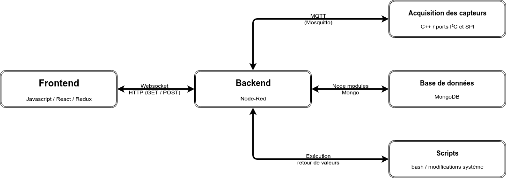

# MOvIT Plus
Ce répertoire contient tous les éléments nécessaires pour faire fonctionner un système MOvIt+. L'utilisation d'une **image préconfigurée** et des **scripts** de mise à jour est recommandée [**[installation rapide](#1-installation-rapide "Section de ce document")**], mais il possible de suivre les instructions et la documentation pour préparer un système à partir d'une image _Rasbian Lite_ [**[installation complète](#2-installation-manuelle "Section de ce document")**].

____

# Documentation des parties du projet
||
|:----------:|
|**Figure 1 : Structure générale du projet**|

## MOvIT-Detect-Frontend
**Site web interactif :** C'est le frontend du système, utilisé par le clinicien et le patient. Ce code utilise React et Redux afin de créer une application web fluide. Les données sont affichées sous forme de graphique facile à lire et à interpréter. 

## MOvIT-Detect-Backend
**Backend, base de données et scripts** : Le backend du système a été conçu en node-red, ce qui permet d'effectuer des modifications rapidement et simplement sur une interface visuelle. Il reçoit les données via MQTT du code d'acquisition et enregistre les données dans une base de données MongoDB localement. Les données sont alors traitées et peuvent être affichées à l'aide de requête GET et POST, et ainsi utilisé par le frontend pour afficher l'information.

## MOvIT-Detect
**Acquisition des capteurs et traitement des données** : Contient tout le code nécessaire pour communiquer avec des capteurs via I2C et SPI à partir d'un Raspberry Pi Zero W et des circuits imprimés faits sur mesure. La communication avec le backend se fait via MQTT. Ce code est écrit en C++ et fonctionne sur Raspberry Pi Zero W. Il pourrait être modifié et compilé pour d'autres architectures relativement facilement.

## MOvIT-Hardware
**Matériel et composantes** : Ce répertoire contient tous les fichiers nécessaires à la fabrication, ce qui permet de recréer le système en entier. Il contient tous les designs des cases à imprimer en 3D ainsi que les circuits imprimées utilisés et une liste du matériel nécessaire.
____
<br>

# Table des matières :

- [Documentation des parties du projet](#documentation-des-parties-du-projet)
  - [MOvIT-Detect-Frontend](#movit-detect-frontend)
  - [MOvIT-Detect-Backend](#movit-detect-backend)
  - [MOvIT-Detect](#movit-detect)
  - [MOvIT-Hardware](#movit-hardware)
- [Procédures d'installation](#proc%c3%a9dures-dinstallation)
  - [1. Installation rapide](#1-installation-rapide)
    - [1.2. Flashage](#12-flashage)
    - [1.3. Configuration réseau](#13-configuration-r%c3%a9seau)
    - [1.4. Initialisation automatisée](#14-initialisation-automatis%c3%a9e)
    - [1.5. Vérification](#15-v%c3%a9rification)
  - [2. Installation manuelle](#2-installation-manuelle)
  - [3. Génération d'images](#3-g%c3%a9n%c3%a9ration-dimages)
      - [Préparation du système](#pr%c3%a9paration-du-syst%c3%a8me)
      - [Création d'une image](#cr%c3%a9ation-dune-image)
  - [4. Mise à jour du système](#4-mise-%c3%a0-jour-du-syst%c3%a8me)
- [Documentation des scripts](#documentation-des-scripts)
    - [Service d'initialisation](#service-dinitialisation)
    - [Script d'initialisation au démarrage](#script-dinitialisation-au-d%c3%a9marrage)
    - [Script de mise à jour](#script-de-mise-%c3%a0-jour)
    - [Script de configuration](#script-de-configuration)
    - [Script de création d'images](#script-de-cr%c3%a9ation-dimages)
- [Déboggage](#d%c3%a9boggage)
    - [Connection à l'appareil](#connection-%c3%a0-lappareil)
    - [Problèmes de réseau](#probl%c3%a8mes-de-r%c3%a9seau)
      - [Spécification de la connection réseau](#sp%c3%a9cification-de-la-connection-r%c3%a9seau)
    - [Problèmes d'installation](#probl%c3%a8mes-dinstallation)
    - [Problemes de performance](#probl%c3%a8mes-de-performance)
    - [Autres problèmes](#autres-probl%c3%a8mes)
- [Autre documentation](#autre-documentation)
  - [Utilisation de Github pour le développement](#utilisation-de-github-pour-le-d%c3%a9veloppement)
    - [Mise à jour des sous-répertoires](#mise-%c3%a0-jour-des-sous-r%c3%a9pertoires)
  - [Astuces](#astuces)
____
<br>
<br>


# Procédures d'installation
## 1. Installation rapide

L'image préconfigurée est disponible sous l'onglet _"Releases"_ de GitHub.
### 1.2. Flashage
Elle doit être flashée à l'aide d'un logiciel comme [Balena Etcher](https://www.balena.io/etcher/ "Site officiel de Balena Etcher") sur une carte SD. Avec ce logiciel, il suffit de **brancher la carte** SD avec un adaptateur approprié, de **sélectionner l'image** téléchargée, puis de **lancer le flashage**. Une fois terminé, il peut être nécessaire de sortir et de réinsérer la carte afin de faire une dernière modification telle que décrite ci-dessous.

### 1.3. Configuration réseau
Il est recommandé de **placer un fichier nommé `wpa_supplicant.conf` dans la partition `boot`** d'une carte SD nouvellement flashé. Celui-ci doit être rempli selon la structure ci-bas avec les informations pour se connecter au réseau wifi choisi. Le système l'utilisera afin de permettre une connexion au réseau wifi spécifié dès les premiers démarrages.
**`wpa_supplicant.conf`** :
```bash
country=CA
ctrl_interface=DIR=/var/run/wpa_supplicant GROUP=netdev
update_config=1

network={
    ssid="NOM_DU_RESEAU" #Remplacer NOM_DU_RESEAU par le nom du réseau désiré
    psk="MOT_DE_PASSE" #Remplacer MOT_DE_PASSE par le mot de passe de celui-ci
    id_str="AP1"
}
```

### 1.4. Initialisation automatisée
Des scripts s'activant automatiquement permettent d'initialiser un nouvel appareil. Aucune action n'est requise outre que d'**insérer la carte SD** et de **brancher l'appareil**. L'exécution de ces scripts peut prendre quelques minutes.

> Attention : **l'appareil ne doit pas être débranché** pendant son initialisation!

> L'initialisation automatisé **nécessite une connection à internet** pour fonctionner([spécification de cette connection internet](#sp%c3%a9cification-de-la-connection-r%c3%a9seau)). L'[étape 1.3](#13-configuration-r%c3%a9seau) peut être répété si une erreur s'est glissée dans le fichier `wpa_supplicant.conf`.
> Si les scripts ne fonctionnent pas, il peut être nécessaire de se connecter en SSH et de relancer le script lorsque la configuration réseau est réparée ([documentation de configuration wifi](https://github.com/introlab/MOvITPlus/blob/master/docs/FR/InstallationLogiciel/ConfigurationSysteme.md#21-connection-%c3%a0-un-r%c3%a9seau-wi-fi)).  Pour plus de détails, voir la section [déboggage](#d%c3%a9boggage).

### 1.5. Vérification
À ce point-ci, le système devrait être correctement configuré. Pour tester s'il est fonctionnel, il suffit de se connecter sur le point d'accès de l'appareil (Movit-******), puis d'accéder à l'adresse `movit.plus` dans un navigateur. Lorsqu'une page apparait, il suffit de se connecter avec les identifiants voulus. Voir la documentation de la partie frontend ou la documentation d'utilisation pour plus de détails.


## 2. Installation manuelle
Un nouveau système peut être installé manuellement en suivant la documentation sur la [configuration d'un nouveau système](https://github.com/introlab/MOvITPlus/blob/master/docs/FR/InstallationLogiciel/ConfigurationSysteme.md "Configuration du système"), puis la documentation de chacune des parties du projet ([MOvIT-Detect](), [MOvIT-Detect-Backend](), [MOvIT-Detect-Frontend]()).
Il également possible d'utiliser le script **`MovitPlusSetup.sh`**. Ce dernier effectue essentiellement toutes les étapes nécessaires pour générer l'image préconfigurée en partant d'une image _Rasbian Lite_. Voir les [explications sur le script de configuration](#script-de-configuration).


## 3. Génération d'images
#### Préparation du système
Afin d'avoir une image fonctionnelle et pratique, plusieurs étapes s'imposent. Bien évidemment, la majorité de la configuration décrite dans la documentation doit être complétée, mais il faut également retirer la configuration dans `wpa_supplicant.conf`, retirer `70-persistent-net.rules`, retirer les fichiers logs sous `/home/pi`, mettre à jour `/etc/hostname`, `/etc/hosts` et `/etc/hostapd/hostapd.conf` avec le _hostname_ Movit-NOCONF puis finalement activer le service `movit_setup.service`.
Toutes ces étapes peuvent être réalisé avec le [script de configuration](#script-de-configuration) et son option `--prepare`.

> Attention : Le script n'à pas été maintenu à jour ni testé.

#### Création d'une image
Lorsque le système est proprement configuré, sur un autre ordinateur tournant préférablement sous Linux, il faut suivre les [instructions disponibles sur ce site](https://medium.com/platformer-blog/creating-a-custom-raspbian-os-image-for-production-3fcb43ff3630). Pour rendre le processus plus rapide dans le cas où plusieurs images doivent être générée et testée, le script `CreateImage.sh` peut être modifié accordement à votre installation.

## 4. Mise à jour du système
La méthode de mise à jour implémentée consiste en l'exécution d'un script. Au moment de débuter une mise à jour, la version la plus récente de celui-ci se trouve sur le repertoire en ligne du projet. Pour ces raisons, la mise à jour du projet avec Git se fait avec la commande suivante : 
```bash
curl -s https://raw.githubusercontent.com/introlab/MOvITPlus/master/updateProject.sh | sudo bash -s - --git-update
```
> Ce script avec cet argument ne met pas à jour les modules du backend et du frontend. Ces étapes doivent être faites manuellement au besoin. Il recompile cependant le code d'acquisition.

De plus, pour les mises à jours de la configuration du système s'il y lieu, un simple appel au script `updateProject.sh` avec l'argument `--sys-config` suffit.
```bash
sudo /home/pi/MOvITPlus/./updateProject.sh --sys-config
```
Voir la [documentation des scripts](#script-de-mise-%c3%a0-jour "Script de mise à jour") plus bas pour de plus amples détails.
____
<br>

# Documentation des scripts
### Service d'initialisation
Un service nommé `movit_setup.service` s'occupe de lancer le script d'initialisation du système `firstBootSetup.sh` au bon moment dans la sécance de démarrage. Celui-ci se trouve dans `/etc/systemd/system/` et permet notamment de redémarrer le système si le script s'exécute avec succès. Il est activé par défaut dans les images préconfigurées afin de s'exécuter au premier démarrage et il se désactive uniquement si le script termine sa tâche avec succès.

### Script d'initialisation au démarrage
**`firstBootSetup.sh`**
Le script effectue la configuration de son _hostname_ et de quelques autres paramètres spécifiques à chaque appareil.
Le script procède ensuite à l'installation de chacune des composantes du projet dans leur version stable la plus à jour. Celles-ci correspondent aux tags de version référencés dans ce répertoire parent. [Ces tags peuvent être mis à jour](#mise-%c3%a0-jour-des-sous-r%c3%a9pertoires "Mise à jour des sous-répertoires"). La configuration se termine par l'écriture du temps système sur le RTC _(Real Time Clock)_ puis avec un lancement du script de mise à jour (`updateProject.sh`) avec l'argument `--sys-config`.

Ce script doit demeurer sous `/home/pi/` à cause du service qui le lance au démarrage et la façon de l'exécuter manuellement est donc `/home/pi/./firstBootSetup.sh`. Voici les options qui peuvent être entrées en argument :
   - **`--restore`** : Restauration de l'appel au démarrage de ce script pour le prochain démarrage
   - **`--remove`** : Suppression de l'appel au démarrage de ce script
   - **`--no-git`** : Empêche l'exécution des étapes liées au téléchargement du projet avec Git
   - _`--fromService`_ : Différencie les exécutions manuelles des lancements au démarrage dans les logs. Ne pas l'utiliser manuellement.

Additionnelement, l'ajout de l'argument **`--console-log`** redirige la sortie de l'exécution à la console. Les logs ne sont pas sauvegardés lors de l'utilisation de cet argument.

Ce script peut également être utilisé pour mettre à jour tous les fichiers en lien avec l'adresse MAC physique d'un appareil. Par exemple, si la carte SD est installée dans un autre RaspberryPi, les références à l'adresse MAC doivent être changées pour correspondre à cette nouvelle adresse. Pour se faire, il faut appeler le script (idéalement avec l'argument `--nogit` pour éviter une nouvelle tentative d'installation des répertoires avec _Git_). Il est aussi possible de simplement réactiver le service avant de changer la carte SD d'appareil.

> Ce script enregistre la sortie de ses exécutions dans `/home/pi/firstBootSetup.log`


### Script de mise à jour
**`updateProject.sh`**
Le script de mise à jour permet la mise à jour des fichiers nécessaires au projet, la mise à jour de la configuration du RaspberryPi et surtout l'initialisation d'une nouvelle instance du projet. Voici les options qui peuvent être entrées en argument :
   - **`--init-project`** : Initialisation du projet (ex: nouvelle base de donnée et installation avec Yarn et NPM)
   - **`--sys-config`** : Mise à jour de la configuration du système (ex: services de démarrage)
   - **`--git-update`** : Mise à jour des répertoires du projet avec Git (devrait être exécuté avec `curl`, voir plus bas)

Additionnellement, l'ajout de l'argument **`--console-log`** redirige la sortie de l'exécution à la console. Les logs ne sont pas sauvegardés lors de l'utilisation de cet argument.

Avec **`--init-project`**, le script s'occupe d'installer le backend, d'initialiser la base de données, d'installer le frontend puis finalement de compiler le code d'acquisition. Il termine en activant tous les services pour le prochain démarrage.
L'exécution de ce script peut prendre environ **30 minutes** dans l'état actuel du projet.
> Pour voir davantage de détails sur la progression de Yarn et NPM directement dans la console, il est possible d'ajouter l'argument `--console-log`.

Pour l'argument **`--git-update`**, le script devrait être exécuté avec la commande suivante de façon à aller chercher la dernière version du script de mise à jour.
```bash
curl -s https://raw.githubusercontent.com/introlab/MOvITPlus/master/updateProject.sh | sudo bash -s - --git-update
```

> Ce script enregistre la sortie de ses exécutions dans `/home/pi/updateProject.log.log`

### Script de configuration
**`MovitPlusSetup.sh`**
Ce script vise à simplifier le paramétrage d'une image _Rasbian Buster Lite_ dans le but de générer une image préconfigurée. Cependant, le script n'a pas été testé complètement et représente davantage une piste sur la façon d'y arriver qu'un moyen certain. La dernière partie du script permet d'annuler en partie les effets de l'essai du script `firstBootSetup.sh`. Voici les options qui peuvent être entrées en argument :
   - **`--fresh-rasbian-image`** : Exécution des différentes parties du script à la suite avec une confirmation entre chaque étape.
   - **`--prepare`** : Nettoyage et préparation de l'appareil en vue de la création d'une image
> **Attention :** Ce script n'a pas été testé complètement et certaines erreurs plus ou moins importantes pourraient survenir. Il est recommendé d'exécuter ce script prudemment et de vérifier chaque étape.

### Script de création d'images
**`CreateImage.sh`**
Ce script vise à faciliter la génération d'images selon [cette méthode](https://medium.com/platformer-blog/creating-a-custom-raspbian-os-image-for-production-3fcb43ff3630) une fois qu'une carte SD entièrement configurée est insérée. Il incorpore le clonage de la carte, l'exécution du [script piShrink.sh](https://github.com/Drewsif/PiShrink) ainsi que le lancement de la [version CLI de Balena Etcher](https://github.com/balena-io/balena-cli). Il doit être adapté aux cas d'utilisation particuliers à chaque fois au besoin.

___

<br>
<br>

# Déboggage
Si des problèmes surviennent lors de l'exécution des scripts, la façon la plus facile de règler les problèmes est d'utiliser l'information contenue dans les fichiers _.log_. Les deux fichiers qui devraient être générés sont `firstBootScript.log` et `updateProject.log.log` dans le répertoire ` /home/pi/`.

### Connection à l'appareil
Avant de débogger, il faut d'abord se connecter à l'appareil en SSH (ou avec un clavier, un écran et les adaptateurs appropriés). La connexion se fait à partir d'un autre ordinateur connecté au même réseau avec la commande `ssh pi@hostname`, où hostname est le nom de l'appareil.

> Pour trouver le nom du Raspberry Pi, il suffit de regarder le nom du point d'accès créé par le Pi. Autrement, si celui-ci n'a pas encore réussi à terminer sa configuration ou qu'un erreur est survenu pendant celle-ci, alors le hostname du Pi sera `Movit-NOCONF`.

L'utilisateur est `pi` et le mot de passe `movitdev` par défaut.

### Problèmes de réseau
Les scripts quitterons rapidement avec un message d'erreur semblable si un problème est detecté avec la configuration réseau :
```bash
### The network is down, cannot run first boot setup
### Please fix internet connection and ...
```
Cette connection est critique au fonctionnement du système et à son initilisation. Vérifier le contenu de `/etc/wpa _supplicant/wpa _supplicant.conf` est donc une étape essentielle. La [documentation de la configuration réseau](https://github.com/introlab/MOvITPlus/blob/master/docs/FR/InstallationLogiciel/ConfigurationSysteme.md#2-configuration-r%c3%a9seau) peut se révéler très utile et, finalement, le respect des spécifications réseaux mentionnées ci-dessous peut être déterminant.

#### Spécification de la connection réseau
Le réseau doit supporter l'**échange de _ping_** avec des serveurs externes ainsi que la découverte et la **communication avec les autres appareils connectés sur le même réseau** pour les fonctions de SSH. Cela signifie donc que certains réseaux publiques se prêtent difficiliement à ce cas d'utilisation. Les "_captive portals_" ou redirections sur une page web avant d'établir une connection (_sign-in page_) peuvent également rendre le processus [beaucoup plus complexe](https://superuser.com/questions/132392/using-command-line-to-connect-to-a-wireless-network-with-an-http-login).
Les réseaux domestiques sont ainsi à prioriser. Un partage de connection LTE peut aussi dépanner.

### Problèmes d'installation
> Notamment avec le script `updateProject.sh` et l'argument `--init-project` ou avec `npm install` et `yarn install`.

Bien qu'il soit probablement plus rapide de recommencer le processus complet, certains problèmes d'installation avec NPM et Yarn peuvent être résous facilement. Ces problèmes peuvent survenir spécialement si le Pi est débranché pendant son initialisation.

Avec le frontend et Yarn :
```bash
cd ~/MOvITPlus/MOvIT-Detect-Frontend && sudo rm -r node_modules/ #Suprime les modules installés
yarn cache clean #Force Yarn à tout télécharger lors de sa prochaine exécution
```

Avec le backend et NPM :
```bash
cd ~/MOvITPlus/MOvIT-Detect-Backend && sudo rm -r node_modules/ #Suprime les modules installés
npm cache verify #Force NPM à tout télécharger lors de sa prochaine exécution
```

### Problèmes de performance
Le Raspberry Zero n'a qu'un seul coeur et il risque de manquer la réception de données des capteurs par les ports SPI et I²C dans certains cas. Les lectures s'excutant à toutes les secondes, il possible qu'une de celles-ci soit uniquement partielle. Le code d'acquisition peut également crasher (la détection des crashs se fait avec un watchdog dans le `main.cpp`) et redémarrer (grâce au service avec *systemd*) à cause de ce même problème de lecture s'il reste pris dans l'attente des données d'un des capteurs.

L'influence la plus importante sur la fréquence de ces crashs est l'utilisation élevée du processeur par d'autres programmes. En plus de la commande `sudo systemctl status movit_acquisition.service` qui retourne l'état du service gérant l'exécution du code d'acquitision, la commande suivante rapporte chacun des démarrages de celui-ci, incluant le démarrage initial. Il est donc possible d'évaluer la fréquence de crash du code d'acquisition.
```bash
journalctl -u movit_acquisition.service | grep Started
```
> La rotation automatique des logs (avec _logrotate_), causera la perte des parties de logs plus anciennes occasionnellement. La commande ci-haut n'est donc pas fiable à 100%, il faut également se fier aux dates et heures enregistrées.

De plus, la commande `htop` peut permettre de visualiser les processus actifs et l'utilisation du processeur.

### Autres problèmes
Certains autres problèmes reliés plus spécifiquement à certaine partie du code sont détaillés dans leur documentation respective. Cette documentation se trouve dans les _README.md_ ainsi que directement dans les parties de code consernées.
____
<br>

# Autre documentation
## Utilisation de Github pour le développement
### Mise à jour des sous-répertoires
Avant un nouveau `git commit`, si désiré, il est possible de changer les tags des versions des sous-répertoires. 
```bash
git submodule update --remote
```
Cette commande permet de mettre à jour les tags des sous-répertoires à leur version la plus récente sur leur `origin/master` respectif. Ces changements apparaissant ensuite dans la liste des changements avec `git status`.

En faisant `git add`, suivit des dossiers et fichiers à mettre à jour, puis les commandes habituelles `git commit` et `git push`, il est possible de rendre ces changements officiels. Le prochain clone avec les sous-modules ira ainsi chercher les versions les plus à jour du répertoire.

> Consultez la [documentation sur les sous-modules GitHub](https://git-scm.com/book/en/v2/Git-Tools-Submodules "GitHub Submodules") pour plus de détails.


## Astuces
- Il est possible de suivre le résultat de l'exécution d'un des scripts qui produit un fichier _.log_ en temps réel avec une commande comme `tail -fn 50 nomdufichier.log`, qui affichera les 50 dernières lignes ainsi que celles qui se rajouteront en temps réel.
- Pour exécuter uniquement certaines parties d'un script, il peut être plus rapide de faire un `if false; then` en début, et `fi` en fin du segment qui doit être ignoré que de commenter toutes les lignes.
- Pour bien comprendre le fonctionnement des scripts : [Bash scripting cheatsheet](https://devhints.io/bash)
<br>
<br>