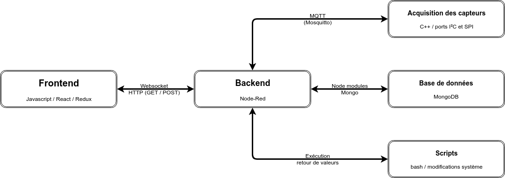

# MOvIT Plus
Ce répertoire contient tous les éléments nécessaires au fonctionnement d'un système MOvIt+. L'utilisation d'une **image préconfigurée** est recommandée [**[installation rapide](#1-installation-rapide "Section de ce document")**], mais il possible de suivre les instructions et la documentation pour préparer un système à partir d'une image _Rasbian_ / _RaspberryPi OS_ [voir: **[installation complète](#2-installation-manuelle "Section de ce document")**].

____

# Documentation des parties du projet
||
|:----------:|
|**Figure 1 : Structure générale du projet**|

## [MOvIT-Detect-Frontend](MOvIT-Detect-Frontend/README.md)
**Site web interactif :** C'est le frontend du système, utilisé par le clinicien et le patient. Ce code utilise React et Redux afin de créer une application web fluide. Les données sont affichées sous forme de graphique facile à lire et à interpréter. 

## [MOvIT-Detect-Backend](MOvIT-Detect-Backend/README.md)
**Backend, base de données et scripts** : Le backend du système a été conçu en node-red, ce qui permet d'effectuer des modifications rapidement et simplement sur une interface visuelle. Il reçoit les données via MQTT du code d'acquisition et enregistre les données dans une base de données MongoDB localement. Les données sont alors traitées et peuvent être affichées à l'aide de requête GET et POST au backend, et ainsi utilisé par le frontend pour afficher l'information.

## [MOvIT-Detect](MOvIT-Detect/README.md)
**Acquisition des capteurs et traitement des données** : Contient tout le code nécessaire pour communiquer avec des capteurs via I2C et SPI à partir d'un Raspberry Pi (Rpi3 / Rpi4 recommandé) et des circuits imprimés faits sur mesure. La communication avec le backend se fait via MQTT. Ce code est écrit en C++ et fonctionne nativement. Il pourrait être modifié et compilé pour d'autres architectures relativement facilement.

## [MOvIT-Hardware](MOvIT-Hardware/README.md)
**Matériel et composantes** : Ce répertoire contient tous les fichiers nécessaires à la fabrication, ce qui permet de recréer le système en entier. Il contient tous les designs des boîtiers à imprimer en 3D ainsi que les circuits imprimées utilisés et une liste du matériel nécessaire.
____
<br>

# Table des matières :

- [MOvIT Plus](#movit-plus)
- [Documentation des parties du projet](#documentation-des-parties-du-projet)
  - [MOvIT-Detect-Frontend](#movit-detect-frontend)
  - [MOvIT-Detect-Backend](#movit-detect-backend)
  - [MOvIT-Detect](#movit-detect)
  - [MOvIT-Hardware](#movit-hardware)
- [Table des matières :](#table-des-matières-)
- [Procédure d'installation](#procédure-dinstallation)
  - [1. Installation rapide (recommandée)](#1-installation-rapide)
    - [1.2. Flashage](#12-flashage)
    - [1.3. Configuration du réseau sans fil (wifi)](#13-configuration-du-réseau-sans-fil-wifi)
  - [2. Installation manuelle](#2-installation-manuelle-recommandée)
  - [3. Connection SSH à l'appareil](#3-connection-ssh-à-lappareil)
  - [4. Mise à jour du système](#4-mise-à-jour-du-système)
____
<br>

# Procédure d'installation
## 1. Installation rapide

> L'image la plus récente n'est pas encore disponible. Il est recommandé de télécharger le code pour l'installation et de suivre la procédure à l'étape [installation manuelle](#2-installation-manuelle).

L'image préconfigurée est disponible sous l'onglet ["Releases"]([https://](https://github.com/introlab/MOvITPlus/releases)) de GitHub. Utilisez la dernière version à jour.

### 1.2. Flashage
L'image doit être flashée à l'aide d'un logiciel comme [Balena Etcher](https://www.balena.io/etcher/ "Site officiel de Balena Etcher") sur une carte SD. Avec ce logiciel, il suffit de **brancher la carte** SD avec un adaptateur approprié, de **sélectionner l'image** téléchargée, puis de **lancer le flashage**. Une fois terminé, il peut être nécessaire de sortir et de réinsérer la carte afin de faire une dernière modification telle que décrite ci-dessous.

### 1.3. Configuration du réseau sans fil (wifi)
Il est recommandé de **placer un fichier nommé `wpa_supplicant.conf` dans la partition `boot`** d'une carte SD nouvellement flashée. Celui-ci doit être rempli selon la structure ci-bas avec les informations pour se connecter au réseau wifi choisi. Le système l'utilisera afin de permettre une connexion au réseau wifi spécifié dès les premiers démarrages.
**`wpa_supplicant.conf`** :
```bash
country=CA
ctrl_interface=DIR=/var/run/wpa_supplicant GROUP=netdev
update_config=1

network={
    ssid="NOM_DU_RESEAU" #Remplacer NOM_DU_RESEAU par le nom du réseau désiré
    psk="MOT_DE_PASSE" #Remplacer MOT_DE_PASSE par le mot de passe de celui-ci
    id_str="AP1"
}
```

## 2. Installation manuelle (recommandée)
Un nouveau système peut être installé manuellement en suivant la documentation sur la [configuration d'un nouveau système](docs/FR/InstallationLogiciel/ConfigurationSysteme.md "Configuration du système"), puis la documentation de chacune des parties du projet ([MOvIT-Detect](), [MOvIT-Detect-Backend](), [MOvIT-Detect-Frontend]()).

## 3. Connection SSH à l'appareil
Le raspberry Pi démarre avec un point d'accès WiFi embarqué qui se nomme `Movit-NOCONF` avec l'image par défaut. Le mot de passe du point d'accès est `movitplus`. Une fois connecté au point d'accès, vous pouvez exécuter la commande suivante pour la connexion par SSH:
```bash
ssh pi@192.168.10.1
```
>L'utilisateur par défaut est `pi` et le mot de passe est `movitdev`.

## 4. Mise à jour du système

Cette section est en construction.

____
<br>
