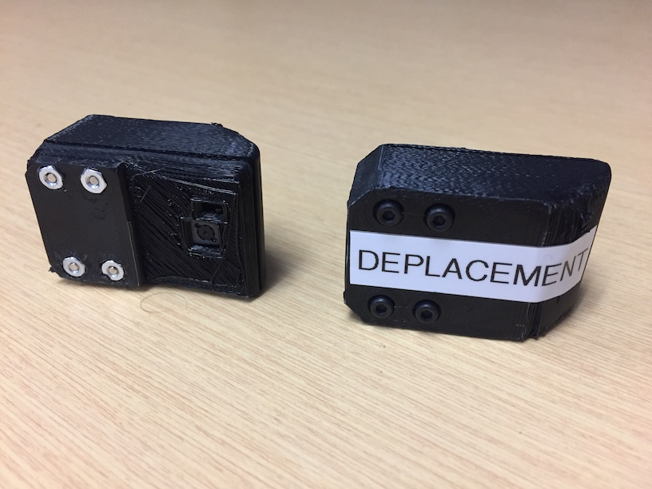
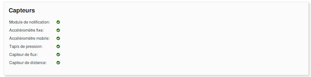

# MOVIT+ - GUIDE D’INSTALLATION DES MODULES ET CONFIGURATION DU SYSTÈME

Révisions:

* 16/04/2019, Dominic Létourneau, Alex Morin. Écriture du document à partir de l'ancien guide d'installation.

## INTRODUCTION

Ce guide explique les étapes à suivre pour installer tous les modules nécessaires au bon fonctionnement du système MOvIT+ ainsi que sa configuration sur n’importe quel fauteuil roulant (motorisé ou non).  Ce guide prévoit que tous les modules nécessaires sont préalablement assemblés et prêts à être utilisés.

## MODULES REQUIS

Voici la liste des composants qui seront nécessaires à l'installation :

### **Module de l’unité centrale de contrôle**

|*Figure 1 : Unité centrale de contrôle*|
|:----------:|
||

La Figure 1 montre l'unité centrale de contrôle du système (UC). Elle est composée d'un système embarqué RaspberryPi Zero et comporte un port USB pour l'alimentation, huit (8) ports de connexion RJ-12 (en gris) pour les modules / capteurs à connecter et un port RJ-45 (en noir) utilisé pour le module capteur de déplacement.

### **Module de centrale inertielle (x2)**

|*Figure 2 : Centrale Inertielle (IMU)*|
|:----------:|
||

La Figure 2 montre un module de centrale inertielle. Nous utilisons deux types de modules dans le système. Ils sont identifiés IMU Fixe et IMU Mobile. Physiquement, les deux modules sont identiques. Ils diffèrent seulement dans l'électronique qui est à l'intérieur. Plus précisément, la différence se trouve dans les composants MPU6050 qui sont configurés pour répondre à deux adresses I2C différentes sur le bus de communication. En tandem, ces modules servent à mesure l'angle de bascule. Nous mesurons l'angle de l'IMU fix par rapport à l'IMU mobile.

### **Module de notification**

|*Figure 3 : Module de notification*|
|:----------:|
||

La Figure 3 présente le module de notification. Il est composé d'un bouton poussoir, deux diodes electro-luminescente (DELs, rouge et vert) et d'un moteur vibreur. Il sert à avertir l'utilisateur du fauteuil lorsque c'est le temps d'effectuer une bascule.

### **Module du tapis de pression**

|*Figure 4 : Tapis de pression avec connecteur*|
|:----------:|
||

|*Figure 5 : Module de pression*|
|:----------:|
||

Les Figures 4 et 5 présentent le tapis de pression ainsi que le module d'acquisition des signaux du tapis de pression. Le tapis comportes 9 cellules de pression disposés en carré de 3x3. Les cellules sont recouvertes de deux membranes flexibles de caoutchouc (dessous,dessus) servant de protection et permettant une installation facile. Les 2 systèmes sont connetés par un câble plat.

### **Module capteur de déplacement**

|*Figure 6 : Module capteur de déplacement par flux optique*|
|:----------:|
||

La Figure 6 montre le module capteur de déplacement par flux optique. *Nous ne prenons aucune image de l'environnement.  La caméra mesure les déplacements d'une image à l'autre et nous donne les déplacements cartésiens (x,y) en temps réel, comme une souris d'ordinateur*. La caméra doit être dirigée vers le sol ou les roues pour son bon fonctionnement.

### **Câbles de branchement des modules (RJ-12)**

|*Figure 7 : Câble RJ-12*|
|:----------:|
||

La Figure 7 présente les câbles RJ-12 de différentes longueurs nécessaires à connecter les modules à l'unité centrale. Pendant l'installation, choississez les câbles les plus courts possibles parmis ceux fournis. Les câbles peuvent être interchangés au besoin.

### **Câble de branchement du module de déplacement par flux optique (RJ-45)**

|*Figure 8 : Câble RJ-45*|
|:----------:|
||

Il est possible de reconnaître le câble RJ-45, montré à la Figure 8, puisqu'il comprend 8 contacts au lieu de 6 pour le RJ-12. La longueur maximale du câble doit être de 30 cm (1 pied). Ce câble sert à relier le module de déplacement par flux optique.

### **Batterie et câble USB***

|*Figure 9: Batterie USB*|
|:----------:|
||

La Figure 9 montre la batterie USB qui sert à alimenter tout le système avec les capteurs et le module central de contrôle. La batterie doit être rechargée manuellement à chaque jour avec son port de recharge USB.

## MATÉRIEL SUPPLÉMENTAIRE D'INSTALLATION REQUIS

* Velcro
* Ciseaux
* Tie-Wraps (au besoin)

## PROCÉDURE D'INSTALLATION MATÉRIELLE

|*Figure 10 : Schéma global*|
|:----------:|
||

La Figure 10 présente le schéma de connexion global du système. Les prochaines sections décrivent étape par étape comment connecter tous les modules.

### ÉTAPE 1 - INSTALLER L'UNITÉ CENTRALE DE CONTRÔLE

|*Figure 11 : Installation de l'unité centrale*|
|:----------:|
||

|*Figure 12 : Ouvrir la housse Latitude -  Orthofab*|
|:----------:|
||

* L'unité centrale doit être installée à l'arrière du fauteuil, le plus bas possible, car le câble RJ-45 du module de déplacement, qui sera installé dans les prochaines étapes, ne doit pas dépasser 30cm de long (1 pied).
* Les connecteurs RJ-12 et RJ-45 doivent être facilement accessibles.
* Le connecteur USB doit être facilement accessible pour brancher la batterie.
* Un bon endroit pour l'installation est dans la housse « Latitude – Orthofab » qui protègera l'unité centrale et la batterie des intempéries.
  * Dans l’éventualité où l’espace est insuffisant au bas du fauteuil ou que la housse est absente, un petit sac peut être accroché au bas du fauteuil et être utilisé comme alternative pour le rangement de l’unité centrale de contrôle et de la batterie.  
  * Ouvrez la housse « Latitude – Orthofab » tel qu’illustré à la figure x. Rouler ensuite la housse vers le bas pour découvrir le dos de la chaise.
  * Laissez la housse ouverte (ou le sac) pendant toute l'installation.

### ÉTAPE 2 - INSTALLER LE MODULE CENTRALE INERTIELLE FIXE

|*Figure 13 : Installation du module centrale inertielle fixe*|
|:----------:|
||

1. Installez le module IMU Fixe sur la partie base du fauteuil avec du velcro :
   * Le module doit être orienté vers le haut
2. Connectez un câble RJ-12 (le plus court possible) à l'unité centrale. Utilisez n'importe quel connecteur sur les 8 disponibles.

### ÉTAPE 3 - INSTALLER LE MODULE CENTRALE INERTIELLE MOBILE

|*Figure 14 : Installation du module centrale inertielle mobile*|
|:----------:|
||

1. Installez le module IMU Mobile sur la partie bascule du fauteuil avec du velcro :
   * Le module doit être orienté vers le haut
2. Connectez un câble RJ-12 (le plus court possible) à l'unité centrale. Utilisez n'importe quel connecteur sur les 8 disponibles.

### ÉTAPE 4 - INSTALLER LE MODULE DE DÉPLACEMENT (FLUX OPTIQUE)

|*Figure 15 : Installation du module de déplacement*|
|:----------:|
||

1. Installez le module de dépacement avec du velcro :
   * Le module doit être fixé à plus de 8 cm du sol.
   * La caméra doit regarder vers le sol.
2. Connectez le câble RJ-45 (le plus court possible) à l'unité centrale. Utilisez le seul port RJ-45 disponible sur le côté.

### **ÉTAPE 5 - INSTALLER LE MODULE DE NOTIFICATION**

|*Figure 16 : Installation du module de notification*|
|:----------:|
||

1. Installez le module de notification avec du velcro :
   * Le module de notification et son branchement ne doivent pas être accrochant.
   * Le bouton doit se trouver vers le haut.
   * Le câble doit se diriger vers l'arrière du fauteuil.
2. Connectez un câble RJ-12 (le plus court possible) à l'unité centrale de contrôle. Utilisez n'importe quel connecteur sur les 8 disponibles.
   * Les câbles peuvent être fixés aux appuie-bras à l’aide d’attaches (tie-wraps).

### ÉTAPE 6 - INSTALLER LE MODULE DE TAPIS DE PRESSION

|*Figure 17 : Installation du tapis de pression*|
|:----------:|
||

|*Figure 18 : Connexion du tapis de pression avec le module de pression*|
|:----------:|
||

1. Installez le tapis de pression sous le fauteuil. Portez une attention particulière au sens et à la position du tapis. Le câble plat doit être vers le bas (en contact avec le fauteuil) et positionné de façon à ce que le câble plat sorte vers l’arrière (voir figure x).
    1. Le tapis de pression doit être installé le plus centré possible sur le fauteuil.
    2. Le boitier du module de pression et son câble ne doivent pas présenter de risque de coincement avec le système de bascule du fauteuil.
2. Connectez un câble RJ-12 (le plus court possible) à l'unité centrale. Utilisez n'importe quel connecteur sur les 8 disponibles.

### ÉTAPE 7 - INSTALLER LA BATTERIE

|*Figure 19 : Installation de la batterie*|
|:----------:|
||

1. Placez la batterie à proximité de l'unité centrale à l'intérieur de la housse (ou du sac).
2. Connectez le port USB de sortie de la batterie au port USB de l'unité centrale.

### ÉTAPE 8 - FINITION

1. Fixez les câbles qui "trainent" avec des attaches (tie-wraps).
2. Fermer la housse « Latitude – Orthofab ».

## CONFIGURATION LOGICIELLE DU SYSTÈME

Veuillez suivre les prochaines étapes afin de bien configurer le système. **Assurez-vous d'avoir branché la batterie à l'unité centrale avant de poursuivre la configuration**

### ÉTAPE 1 - BRANCHER LA BATTERIE AVEC LE CÂBLE USB À L'UNITÉ CENTRALE

Tous les modules sont alimentés par l'unité centrale de contrôle. Le système prend environ 1 minute à démarrer.

### ÉTAPE 2 - SE CONNECTER AU POINT D'ACCÈS WI-FI

|*Figure 20 : Configuration du point d'accès WiFi*|
|:----------:|
||

Quand le système est démarré correctement, un point d'accès WiFi va apparaître. À l'aide de votre tablette ou de votre ordinateur, connectez vous au réseau qui se nomme **MOvIT+-XXXXXX**, où XXXXX est le numéro du point d'accès qui est identifié sur chaque unité centrale par une étiquette. Un example est donné à la Figure 20.

`Note: Le mot de passe par défaut du point d'accès est : "movit_plus"`

### ÉTAPE 3 - SE CONNECTER À L'INTERFACE WEB DU SYSTÈME

Une fois connecté au réseau WiFi :

1. Connectez-vous à l'adresse [http://192.168.50.1](http://192.168.50.1) à l'aide de votre navigateur Internet.

|*Figure 21 : Page de connexion*|
|:----------:|
||

2. Sélectionnez "Clinicien" dans l'interface, comme montré à la figure 21.
`Les mots de passe par défaut pour sont "admin" pour "Clinicien" et "user" et pour "Usager".`

|*Figure 22 : Page de Configuration*|
|:----------:|
||

1. Cliquez sur l'onglet Configuration dans le menu du haut, comme montré à la Figure 22. Vous obtiendrez une page telle que montré à la Figure 16. Sur cette page, il fau configurer dans l'ordre (les informations pour chaque champ seront visibles si vous videz le texte qu'ils contiennent):
    1. Le nom de l'usager.
    2. L'identifiant TelAsk de l'usager. Ceci sera donné par votre coordonnatrice de projet.
    3. L'angle maximal de bascule.
    4. L'angle minimal de bascule.
    5. Le poids en kg de l'usager.
    6. Adresse de connexion SFTP pour transférer les fichiers à TelAsk. Par défaut à  "www.cati.telask.ca".
    7. Nom d'usager SFTP à utiliser pour le transfert de données. Demandez à votre coordonnatrice de projet pour les détails.
    8. Mot de passe SFTP à utiliser pour le transfert de données. Demandez à votre coordonnatrice de projet pour les détails.

2. Cliquez sur "Sauvegarder" pour enregistrer votre configuration.

|*Figure 23 : Configuration du WiFi pour Internet*|
|:----------:|
||

5. Configurez le réseau WiFi pour Internet tel que montré à la figure 23. Cette étape est nécessaire si vous voulez transmettre des données à TelAsk. Vous devez entrer le nom de réseau ainsi que le mot de passe.

|*Figure 24 : Validation du fonctionnement des capteurs*|
|:----------:|
||

6. Validation de communication des capteurs. La page de configuration montre à la Figure 24 quels capteurs sont connectés. Vous devriez voir des points verts après chaque module. Si vous voyez des points rouges, vérifiez que vos câbles RJ-12 sont bien connectés.

Bravo! Le système est maintenant prêt à être utilisé. Veuillez vous référer au guide d'utilisation pour opérer la plate-forme.

