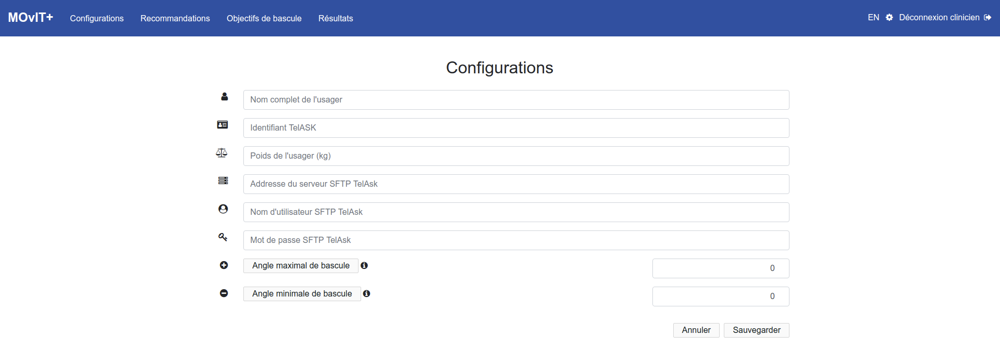

# MOVIT+ - GUIDE D’INSTALLATION DES MODULES ET CONFIGURATION DU SYSTÈME

> Révisions:
> * 16/04/2019, Dominic Létourneau, Alex Morin. Écriture du document à partir de l'ancien guide d'installation.
> * 12/12/2019, Charles Maheu. Correction et mise à jour de certaines informations. Ajout d'images plus représentatives.

## INTRODUCTION

Ce guide explique les étapes à suivre pour installer tous les modules nécessaires au bon fonctionnement du système MOvIT+ ainsi que sa configuration sur n’importe quel fauteuil roulant (motorisé ou non).  Ce guide prévoit que tous les modules capteurs nécessaires, décrits dans la prochaine section, soient préalablement assemblés et prêts à être utilisés.

## MODULES REQUIS

Voici la liste des modules qui seront nécessaires à l'installation :

### **Module de l’unité centrale de contrôle**

||
|:----------:|
|**Figure 1.1 : Unité centrale de contrôle**|
||
|**Figure 1.2 : Unité centrale de contrôle hors de son case**|

La Figure 1 montre ``l'unité centrale de contrôle du système (UC)``. Elle est composée d'un système embarqué [RaspberryPi Zero W](https://www.raspberrypi.org/products/raspberry-pi-zero-w/) et comporte un port USB pour l'alimentation ainsi que huit (8) ports de connexion ``RJ-12`` (en gris) pour les modules / capteurs à connecter.

### **Module de centrale inertielle (x2)**

||
|:----------:|
|**Figure 2 : Centrale Inertielle (IMU)**|

La Figure 2 montre un module de centrale inertielle. Nous utilisons deux types de modules dans le système. Ils sont identifiés ``IMU Fixe`` et ``IMU Mobile``. Physiquement, les deux modules sont identiques. Ils diffèrent seulement dans l'électronique qui est à l'intérieur. Plus précisément, la différence se trouve dans les composants ``MPU6050``, qui sont configurés pour répondre à deux adresses I2C différentes sur le bus de communication. En tandem, ces modules servent à mesurer l'angle de bascule. Nous mesurons l'angle de l'IMU fixe par rapport à celui de l'IMU mobile.

### **Module de notification**

||
|:----------:|
||
|**Figure 3 : Module de notification**|

La Figure 3 présente le module de notification. Il est composé d'un bouton poussoir, deux diodes electroluminescentes (DELs, une rouge et une verte) et d'un moteur vibreur. Il sert à avertir l'utilisateur du fauteuil lorsque c'est le moment d'effectuer une bascule.

### **Module du tapis de pression**

|||
|:----------:|:----------:|
|**Figure 4 : Tapis de pression avec connecteur**|**Figure 5 : Module de pression**|

Les Figures 4 et 5 présentent le tapis de pression ainsi que le module d'acquisition des signaux du tapis de pression. Le tapis comporte 9 cellules de pression, disposées en carré de 3x3. Les cellules sont recouvertes de deux membranes flexibles de caoutchouc (dessous,dessus), servant de protection et permettant une installation facile. Enfin, les 2 systèmes sont connectés avec un câble plat.

### **Câbles de branchement des modules (RJ-12)**

||
|:----------:|
|**Figure 7 : Câble ``RJ-12``**|

La Figure 7 présente les câbles ``RJ-12`` de différentes longueurs. Ceux-ci sont nécessaires pour connecter les modules à l'unité centrale. Pendant l'installation, choississez les câbles les plus courts possibles parmi ceux fournis, et ils peuvent être interchangés au besoin. Les cables ``RJ-12`` comprennent 6 contacts.

### **Batterie et câble USB**

||
|:----------:|
|**Figure 9: Batterie USB**|

La Figure 9 montre la batterie USB (qui sert à alimenter tout le système avec les capteurs), et le module central de contrôle. **La batterie doit être rechargée manuellement à chaque jour avec son port de recharge USB**.

## MATÉRIEL SUPPLÉMENTAIRE D'INSTALLATION REQUIS

* Velcro
* Ciseaux
* Tie-Wraps (au besoin)

## PROCÉDURE D'INSTALLATION MATÉRIELLE

||
|:----------:|
||
|**Figure 10 : Schéma global**|

La Figure 10 présente le schéma de connexion global du système. Les prochaines sections décrivent, étape par étape, comment connecter tous les modules.

### ÉTAPE 1 - INSTALLER L'UNITÉ CENTRALE DE CONTRÔLE

|||
|:----------:|:----------:|
|**Figure 11 : Installation de l'unité centrale de contrôle**||

||
|:----------:|
|**Figure 12 : Ouvrir la housse ``Latitude – Orthofab``**|

* L'unité centrale de contrôle doit être installée à l'arrière du fauteuil, le plus bas possible.
* Les connecteurs ``RJ-12`` doivent être facilement accessibles.
* Le connecteur USB doit être facilement accessible pour brancher la batterie.
* Un bon endroit pour l'installation est dans la housse ``Latitude – Orthofab``, qui protègera l'unité centrale et la batterie des intempéries.
  * Dans l’éventualité où l’espace est insuffisant au bas du fauteuil ou que la housse est absente, un petit sac peut être accroché au bas du fauteuil et être utilisé comme alternative pour le rangement de l’unité centrale de contrôle et de la batterie.  
  * Ouvrez la housse ``Latitude – Orthofab`` tel qu’illustré à la figure x. Roulez ensuite la housse vers le bas pour découvrir le dos de la chaise.
  * Laissez la housse ouverte (ou le sac) pendant toute l'installation.
  * La housse permet de laisser passer les fils de chaque côté facilement.

### ÉTAPE 2 - INSTALLER LE MODULE CENTRALE INERTIELLE FIXE

||
|:----------:|
||
|**Figure 13 : Installation du module centrale inertielle fixe**|

1. Installez le module ``IMU Fixe`` sur la partie base du fauteuil, avec du velcro :
   * Le module peut être orienté selon le choix de l'utilisateur.
   * Il doit être placé sur la partie la plus vibrante de la base. Ex:
     * > Amylior/Amsystem : sur le garde-boue
     * > Othofab : sur la surface verticale à l'arrière de la base
       
||
|:----------:|
|**Figure 14 : Position de l'IMU fixe sur un fauteuil Amylior**|

2. Connectez un câble ``RJ-12`` à l'unité centrale. Utilisez n'importe quel connecteur sur les 8 disponibles.

> La centrale inertielle doit bouger le moins possible une fois installée. Il est recommendé de bien placer les fils pour qu'il ne soit pas accrochant et de solidement fixer le capteur. L'ajout de _tie-wrap_ peut aider.

### ÉTAPE 3 - INSTALLER LE MODULE CENTRALE INERTIELLE MOBILE

||
|:----------:|
|**Figure 14 : Installation du module centrale inertielle mobile**|

1. Installez le module ``IMU Mobile`` sur la partie bascule du fauteuil avec du velcro :
   * Le module peut être orienté selon le choix de l'utilisateur.
2. Connectez un câble ``RJ-12`` à l'unité centrale. Utilisez n'importe quel connecteur sur les 8 disponibles.

> La centrale inertielle doit bouger le moins possible une fois installée. Il est recommendé de bien placer les fils pour qu'il ne soit pas accrochant et de solidement fixer le capteur. L'ajout de _tie-wrap_ peut aider.

### **ÉTAPE 5 - INSTALLER LE MODULE DE NOTIFICATION**

||
|:----------:|
|**Figure 16 : Installation du module de notification**|

1. Installez le module de notification avec du velcro sur un des appuie-bras du fauteuil:
   * Le module de notification et son branchement ne doivent pas être accrochant.
   * Le bouton doit se trouver vers le haut.
   * Le câble doit se diriger vers l'arrière du fauteuil.
2. Connectez un câble ``RJ-12`` (le plus court possible) à l'unité centrale de contrôle. Utilisez n'importe quel connecteur sur les 8 disponibles.
   * Les câbles peuvent être fixés aux appuie-bras à l’aide d’attaches (tie-wraps).

### ÉTAPE 6 - INSTALLER LE MODULE DE TAPIS DE PRESSION

|||
|:----------:|:----------:|
|**Figure 17 : Installation du tapis de pression**|**Figure 18 : Connexion du tapis de pression avec le module de pression**|

1. Installez le tapis de pression sous le fauteuil. Portez une attention particulière au sens et à la position du tapis. Le câble plat doit être vers le bas (en contact avec le fauteuil) et positionné de façon à ce que le câble plat sorte vers l’arrière (voir Figure 17).
    1. Le tapis de pression doit être installé le plus centré possible sur le fauteuil.
    2. Le boitier du module de pression et son câble ne doivent pas présenter de risque de coincement avec le système de bascule du fauteuil (voir Figure 18).
2. Connectez un câble ``RJ-12`` à l'unité centrale. Utilisez n'importe quel connecteur sur les 8 disponibles.

### ÉTAPE 7 - INSTALLER LA BATTERIE

||
|:----------:|
|**Figure 19 : Installation de la batterie**|

1. Placez la batterie à proximité de l'unité centrale à l'intérieur de la housse (ou du sac).
2. Connectez le port USB de sortie de la batterie au port USB de l'unité centrale.

### ÉTAPE 8 - FINITION

1. Fixez les câbles qui "trainent" avec des attaches (tie-wraps).
2. Fermer la housse ``Latitude – Orthofab``.

## CONFIGURATION LOGICIELLE DU SYSTÈME

Veuillez suivre les prochaines étapes afin de bien configurer le système. **Assurez-vous d'avoir branché la batterie à l'unité centrale avant de poursuivre la configuration**

### ÉTAPE 1 - BRANCHER LA BATTERIE AVEC LE CÂBLE USB À L'UNITÉ CENTRALE

Tous les modules sont alimentés par l'unité centrale de contrôle. Le système prend environ 1 minute à démarrer.

### ÉTAPE 2 - SE CONNECTER AU POINT D'ACCÈS WI-FI

||
|:----------:|
|**Figure 20 : Configuration du point d'accès WiFi**|

Lorsque le système est démarré correctement, un point d'accès WiFi apparaît. À l'aide de votre tablette ou de votre ordinateur, connectez-vous au réseau qui se nomme ``Movit-XXXXXX``, où ``XXXXX`` est le numéro du point d'accès (qui est identifié sur chaque unité centrale de contrôle par une étiquette). Un exemple est donné à la Figure 20. 
>NOTE: Utilisez le réseau ``Movit-NOCONF`` le cas échéant

> Le mot de passe par défaut du point d'accès est : ``movitplus``.

### ÉTAPE 3 - SE CONNECTER À L'INTERFACE WEB DU SYSTÈME

Une fois connecté au réseau WiFi :

1. Connectez-vous à l'adresse [movit.plus](movit.plus) à l'aide de votre navigateur Internet.

||
|:----------:|
|**Figure 21 : Page de connexion**|

2. Sélectionnez ``Clinicien`` dans l'interface, tel que montré à la figure 21.
> Les mots de passe par défaut sont les suivants : `Client` : `movit-user` et `Clinicien` : `movit-admin`

||
|:----------:|
|**Figure 22 : Page de Configuration**|

3. Cliquez sur l'onglet ``Configuration`` dans le menu du haut. Vous obtiendrez une page, tel que montrée à la Figure 22. Sur cette page, il faut configurer dans l'ordre les informations suivantes (NOTE: les informations pour chaque champ seront visibles si vous videz le texte qu'ils contiennent.):
    1. Le nom de l'usager.
    2. L'identifiant TelAsk de l'usager. **Cette information vous sera donnée par votre coordonnatrice de projet.**
    3. L'angle maximal de bascule ``en degrés``.
    4. L'angle minimal de bascule ``en degrés``.
    5. Le poids ``en kilogrammes (kg)`` de l'usager.
    6. L'adresse de connexion SFTP, pour transférer les fichiers à TelAsk. Par défaut, elle est à ``www.cati.telask.ca``.
    7. Le nom d'usager SFTP à utiliser pour le transfert de données. **Demandez à votre coordonnatrice de projet pour les détails.**
    8. Mot de passe SFTP à utiliser pour le transfert de données. **Demandez à votre coordonnatrice de projet pour les détails.**
> Cliquez sur ``Sauvegarder`` pour enregistrer votre configuration.

4. Cliquez sur l'onglet "Paramètres" (correspondant à l'engrenage) dans le menu du haut à droite.

||
|:----------:|
|**Figure 23 : Configuration du WiFi pour Internet**|

5. Configurez le réseau WiFi pour avoir accès à Internet, tel que montré à la figure 23. Cette étape est nécessaire si vous voulez transmettre des données à TelAsk. Vous devez entrer le nom de réseau, ainsi que le mot de passe.

||
|:----------:|
|**Figure 24 : Validation du fonctionnement des capteurs**|

6. Validez la communication avec les modules capteurs. À la figure 24, la page de configuration montre quels capteurs sont connectés. Vous devriez voir des points verts à droite de chaque module. Si vous voyez des points rouges, vérifiez que vos câbles ``RJ-12`` sont bien connectés.

||
|:----------:|
|**Figure 25 : Permission d'envoi des données à TelAsk**|

7. Cochez la case de ``Permission concernant l'envoi des données à TelAsk`` si désiré.

8. Cochez la case ``Notifications et enregistrements des bascules`` pour activer les notifications et l'enregistement de l'activité.

9. Cochez, au choix, les cases ``Clignoter la lumière lors d'une notification`` et ``Vibrer lors d'une notification``.

10. Réglez le ``temps de snooze (en minutes)``, pour mettre en pause et rappeler plus tard une notification.

||
|:----------:|
|**Figure 26 : Paramètres des notifications**|

Bravo! Le système est maintenant prêt à être utilisé. **Veuillez vous référer au guide d'utilisation pour opérer la plateforme.**

