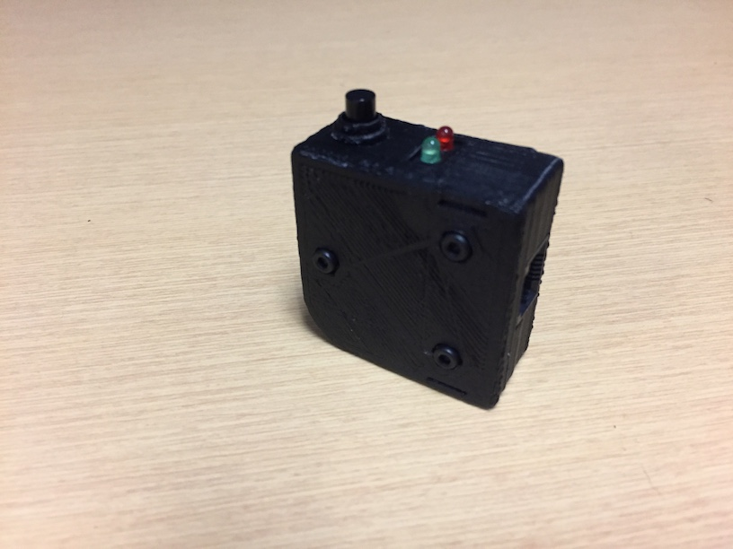

# MOVIT+ - GUIDE D’INSTALLATION DES MODULES ET CONFIGURATION DU SYSTÈME

Révisions:

* 16/04/2019, Dominic Létourneau, Alex Morin (Écriture du document à partir de l'ancien guide d'installation)

## INTRODUCTION

Ce guide explique les étapes à suivre pour installer tous les modules nécessaires au bon fonctionnement du système MOvIT+ ainsi que sa configuration sur n’importe quel fauteuil roulant (motorisé ou non).  Ce guide prévoit que tous les modules nécessaires sont préalablement assemblés et prêts à être utilisés.

## MODULES REQUIS

Voici la liste des composants qui seront nécessaires à l'installation :

### Module de l’unité centrale de contrôle

|*Figure 1 : Unité centrale*|
|:----------:|
||

La Figure 1 montre l'unité centrale du système (UC) est composée d'un système embarqué RaspberryPi Zero et comporte un port USB pour l'alimentation, huit (8) ports de connexion RJ-12 (en gris) pour les modules / capteurs à connecter et un port RJ-45 utilisé pour le module capteur de déplacement.

### Module des centrales inertielles (x2)

|*Figure 5 : Centrale Inertielle (IMU)*|
|:----------:|
||

### Module de notification

|*Figure 6 : Module de notification*|
|:----------:|
||

### Module du tapis de pression

|*Figure 7 : Tapis de pression avec connecteur*|
|:----------:|
||

### Module capteur de déplacement

|*Figure 8 : Module capteur de déplacement*|
|:----------:|
||

### Câbles de branchement des modules (RJ-12)

|*Figure 9 : Câble RJ-12*|
|:----------:|
||

### Câble de branchement du module de déplacement (RJ-45)

|*Figure 10 : Câble RJ-45*|
|:----------:|
||

Il est possible de différencier le câble puisqu'il comprend 8 contacts au lieu de 6 sur le RJ-12.

### Batterie et câble USB

|*Figure 11 : Batterie USB*|
|:----------:|
||

## MATÉRIEL SUPPLÉMENTAIRE D'INSTALLATION REQUIS

* Velcro
* Ciseaux
* Tie-Wraps (10)

## PROCÉDURE D'INSTALLATION MATÉRIELLE
|*Figure 12 : Schéma global*|
|:----------:|
||

## CONFIGURATION LOGICIELLE DU SYSTÈME

Veuillez suivre les prochaines étapes afin de bien configurer le système.

### ÉTAPE 1 - BRANCHER LA BATTERIE AVEC LE CÂBLE USB À L'UNITÉ CENTRALE

Tous les modules sont alimentés par l'unité centrale. Le système prend environ 1 minute à démarrer.

### ÉTAPE 2 - SE CONNECTER AU POINT D'ACCÈS WI-FI

|*Figure 13 : Configuration WiFi*|
|:----------:|
||

Quand le système est démarré correctement, un point d'accès WiFi va apparaître.  À l'aide de votre tablette ou de votre ordinateur, connectez vous au réseau qui se nomme **MOvIT+-XXXXXX**, où XXXXX est le numéro du point d'accès qui est identifié sur chaque unité centrale par une étiquette. Un example est donné à la Figure 13.

`Note: Le mot de passe par défaut du point d'accès est : "movit_plus"`

### ÉTAPE 3 - SE CONNECTER À L'INTERFACE WEB DU SYSTÈME

Une fois connecté au réseau WiFi :

1. Connectez-vous à l'adresse [http://192.168.50.1](http://192.168.50.1) à l'aide de votre navigateur Internet.

|*Figure 15 : Page de connexion*|
|:----------:|
||

2. Sélectionnez "Clinicien" dans l'interface.
`Les mots de passe par défaut pour sont "admin" pour "Clinicien" et "user" et pour "Usager".`

|*Figure 16 : Page de Configuration*|
|:----------:|
||

3. Cliquez sur l'engrenage de configuration dans l'interface en haut à droite. Vous obtiendrez une page telle que montré à la Figure 16. Sur cette page, il fau configurer dans l'ordre (Un tooltip va apparaître quand vous laissez votre souris sur les icônes):
    1. Le nom de l'usager.
    2. L'identifiant TelAsk de l'usager. Ceci sera donné par votre coordonnatrice de projet.
    3. Plus
    4. Moins
    5. Bascule.
    6. Adresse de connexion SFTP pour transférer les fichiers à TelAsk. Par défaut à  "www.cati.telask.ca".
    7. Nom d'usager SFTP à utiliser pour le transfert de données. Demandez à votre coordonnatrice de projet pour les détails.
    8. Mot de passe SFTP à utiliser pour le transfert de données. Demandez à votre coordonnatrice de projet pour les détails.

4. Cliquez sur "Sauvegarder" pour enregistrer votre configuration.

Bravo! Le système est maintenant prêt à être utilisé. Veuillez vous référer au guide d'utilisation pour opérer la plate-forme.

