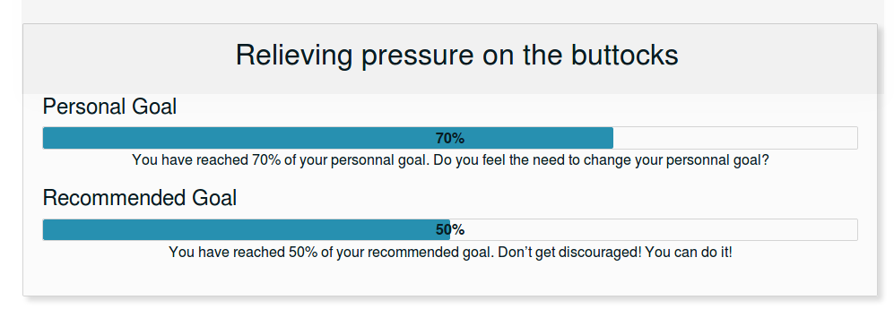
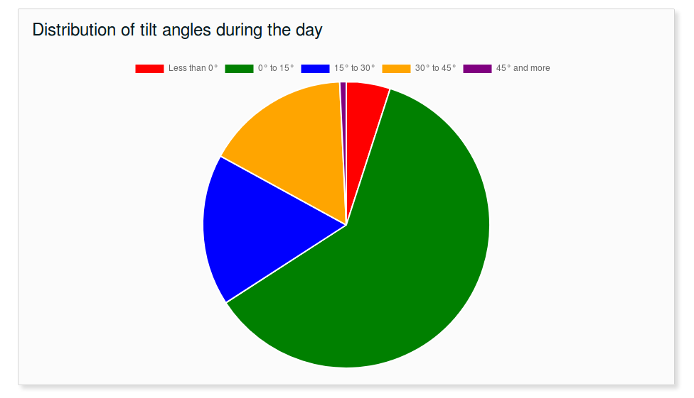
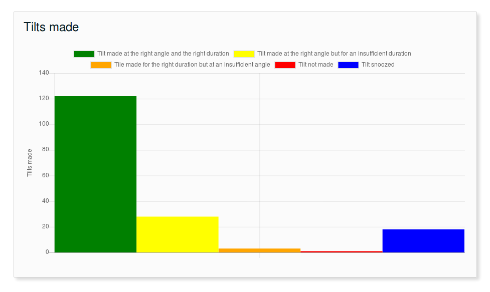
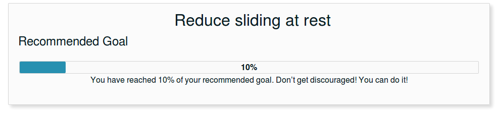
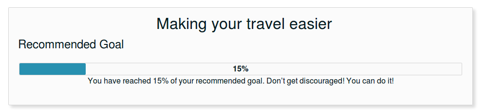

# JSON Data Format
A JSON file containing daily information is transmitted using SFTP according to the configuration of the system stored in its database. The transmission of the file occurs when there is an Internet connection available. The software will make sure to transmit all complete daily report that were not previously transmitted. 

## File Naming Convention
Each transmitted file name contains the userId, the chairId, and the date in regular YYYYMMDD format, in that order. Provided the userId `P10MXJ`, the chairId `EF7413` and the date `March 5, 2019`, the file name will then be `MOVIT+_P10MXJ_EF7413_20190305.json`. The file name is designed to be easily searched, filtered or ordered in the filesystem.

## JSON Formatting
The following section details the different fields in the transmitted JSON object. You can find an example at the end of this document. Each key in the object follows the camel case naming convention. All timestamps are in UNIX time in millisecond since January 1st, 1970 at UTC.

## Object Root Node
The root object contains all the required data to recreate the graphics and store the data in a database. Here is the description of each top level field:

| Key        | Description           | Unit  | Datatype  | Range |
| :------------- |:-------------| :-----:| :-----:| :-----:|
|createdAt|Timestamp of the creation of the file in the same timezone as the sensors|ms|long|0 to today's Date|
|userId|The user Id provided by TelAsk||String||
|maxAngle|The maximum angle of tilt the wheelchair can acheive|degree|Integer|-360° to 360°|
|minAngle|The minimum angle of tilt the wheelchair can acheive|degree|Integer|-360° to 360°|
|date|A user readable date in YYYYMMDD format||String||
|weight|The weight of the patient|Kg|Integer|greater or equal to 0|
|chairId|The unique identifier of the chair||String||
|timezone|The timezone of the device|hours|Integer|-11 to 12|
|rev|The revision of the JSON file format for verification purpose and future additions||String||
|tilt|The tilt data for the day, described below||Tilt Object||
|pressure|The pressure data for the day, described below||Pressure Object||

---

## Tilt Object
This object contains all the tilt data for a specified day. It is separated in multiple fields, each containing data related to a single chart. Here is a description of each field:

| Key        | Description           | Unit  | Datatype  | Range |
| :-------------|:-------------|:-----:|:-----:| :-----:|
|distribution|Contains data related to the distribution of angle, used to create a pie chart. The data is contained in duration_ms, and the explanation of each element of data is in the index||Object||
|distribution.index|Explanation of each value of the data array sorted by index. The length of the array is 5 || String array ||
|distribution.duration_ms|The actual data representing the time spent in each of the five categories of the index | ms | Integer array | greater or equal to 0 |
|tiltCount|Contains data related to the number of tilt done in a day. The data is contained in data, and the explanation of each element in the index ||||
|tiltCount.index|Explanation of each value of the data array sorted by index. The length of the array is 5||Integer Array||
|tiltCount.count_user|Contains data related to the number of tilt done in a day according to the personal goal. The data is contained in count, and the explanation of each element in the index | Number of tilt  | Integer array | greater or equal to 0|
|tiltCount.count_clinician|Contains data related to the number of tilt done in a day according to the recommended goal. The data is contained in count, and the explanation of each element in the index | Number of tilt  | Integer array | greater or equal to 0|
|slidingTravelGoalPercent|The sliding while travelling completion goal | % | Float | 0.0 to 100.0|
|slidingRestGoalPercent|The sliding while at rest completion goal | % | Float  | 0.0 to 100.0|

---

## Pressure Object
This object contains all the pressure data for a specified day. It is separated in multiple fields, each containing data related to a single chart. Here is the description of each field:

| Key        | Description           | Unit  | Datatype  | Range |
| :------------- |:-------------| :-----:| :-----:| :-----:|
|relievePressureGoalPercent|The percentage of completion of the relieve pressure goal set by the clinician| % | Float | 0.0 to 100.0|
|relievePressurePersonalGoalPercent|The percentage of completion of the relieve pressure goal set by the patient| % | Float  | 0.0 to 100.0|
|byTimestamp|Contains an object used as a dictionnary sorted by timestamps in ms. Each timestamp contains a pressureData object explained later. The pressure data can be taken at a maximum of 1 Hz. Each of these objects will need to be shown in a chart||Object||

### pressureData Object
The pressureData object contains all the pressure information at a specific time. This data represents the overall center of pressure as well as the per quadrant center of pressure. Here is the description of each field:

| Key        | Description           | Unit  | Datatype  | Range |
| :-------------|:-------------|:-----:|:-----:|:-----:|
|center|The center of pressure of the patient in x and y coordinate|Inch|Float|-4.0 to 4.0|
|quadrants|The center of pressure of the patient per quadrant starting at the top left quadrant at index 0, then clockwise in an x and y array of coordinate|Inch|Float|-4.0 to 4.0|
|angle|The angle of the chair at this time|degree|Integer|-360° to 360°|

---

# Example JSON
``` .json

{

    "createdAt": 1623853098,

    "userId": "1234",

    "maxAngle": 50,

    "weight": 53,

    "chairId": "7EE21E",

    "date": "20210615",

    "timezone": -4,

    "minAngle": 0,

    "rev": "A",

    "tilt": {

        "distribution": {

            "index": [

                "Less than 0°",

                "0° to 15°",

                "15° to 30°",

                "30° to 45°",

                "More than 45°"

            ],

            "duration_ms": [

                0,

                1000,

                16000,

                3000,

                0

            ]

        },

        "tiltCount": {

            "index": [

                "Good angle and duration",

                "Good angle but insufficient duration",

                "Wrong angle but good duration",

                "Cancelled tilt",

                "Snoozed tilt"

            ],

            "count_user": [

                0,

                1,

                0,

                8,

                0

            ],

            "count_clinician": [

                0,

                1,

                0,

                2,

                0

            ]

        },

        "slidingTravelGoalPercent": 0.0018034265103697023,

        "slidingRestGoalPercent": 1

    },

    "pressure": {

        "dailySittingTimeMinsPerHour": [

            0,

            0,

            0,

            0,

            0,

            0,

            0,

            0,

            0,

            0,

            0,

            0,

            0,

            20,

            24,

            0,

            29,

            60,

            60,

            2,

            0,

            0,

            0,

            0

        ],

        "relievePressureGoalPercent": 0,

        "releivePressurePersonalGoalPercent": 0,

        "byTimestamp": {}

    }

}
```

# Example Graphs
Here are the differents graphs and chart generated from the above sample file

## Relieving Pressure Goal Progress Bar


## Distribution of Angles Pie Chart


## Number of Tilts Achieved in a Day Bar Graph


## Reduce Sliding at Rest Progress Bar


## Reduce Sliding During Travel Progress Bar

