# JSON Data Format
A JSON file containing daily information is transmitted using SFTP according to the configuration of the system stored in its database. The transmission of the file occurs when there is an Internet connection available. The software will make sure to transmit all complete daily report that were not previously transmitted. 

## File Naming Convention
Each transmitted file name contains the userId, the chairId, and the date in regular YYYYMMDD format, in that order. Provided the userId `P10MXJ`, the chairId `EF7413` and the date `March 5, 2019`, the file name will then be `MOVIT+_P10MXJ_EF7413_20190305.json`. The file name is designed to be easily searched, filtered or ordered in the filesystem.

## JSON Formatting
The following section details the different fields in the transmitted JSON object. You can find an example at the end of this document. Each key in the object follows the camel case naming convention. All timestamps are in UNIX time in millisecond since January 1st, 1970 at UTC.

## Object Root Node
The root object contains all the required data to recreate the graphics and store the data in a database. With the daily files it is possible to create graphs according to the day and the month. Here is the description of each top level field:

| Key        | Description           | Unit  | Datatype  | Range |
| :------------- |:-------------| :-----:| :-----:| :-----:|
|createdAt|Timestamp of the creation of the file in the same timezone as the sensors|ms|long|0 to today's Date|
|userId|The user Id provided by TelAsk||String||
|maxAngle|The maximum angle of tilt the wheelchair can acheive|degree|Integer|-360° to 360°|
|minAngle|The minimum angle of tilt the wheelchair can acheive|degree|Integer|-360° to 360°|
|weight|The weight of the user|kg|Integer|greater or equal to 0|
|chairId|The unique identifier of the chair||String||
|date|A user readable date in YYYYMMDD format||String||
|timezone|The timezone of the device|hours|Integer|-11 to 12|
|rev|The revision of the JSON file format for verification purpose and future additions||String||
|tilt|The tilt data for the day, described below||Tilt Object||
|pressure|The pressure data for the day, described below||Pressure Object||

---

## Tilt Object
This object contains all the tilt data for a specified day. It is separated in multiple fields, each containing data related to a single chart. Here is a description of each field:

| Key        | Description           | Unit  | Datatype  | Range |
| :-------------|:-------------|:-----:|:-----:| :-----:|
|distribution|Contains data related to the distribution of angle, used to create a pie chart. The data is contained in duration_ms, and the explanation of each element of data is in the index||Object||
|distribution.index|Explanation of each value of the data array sorted by index. The length of the array is 5 || String array ||
|distribution.duration_ms|The actual data representing the time spent in each of the five categories of the index | ms | Integer array | greater or equal to 0 |
|tiltCount|Contains data related to the number of tilt done in a day. The data is contained in data, and the explanation of each element in the index ||||
|tiltCount.index|Explanation of each value of the data array sorted by index. The length of the array is 5||Integer Array||
|tiltCount.count_user|Contains data related to the number of tilt done in a day according to the personal goal. The data is contained in count, and the explanation of each element in the index | Number of tilt  | Integer array | greater or equal to 0|
|tiltCount.count_clinician|Contains data related to the number of tilt done in a day according to the recommended goal. The data is contained in count, and the explanation of each element in the index | Number of tilt  | Integer array | greater or equal to 0|
|slidingTravelGoalPercent|The sliding while travelling completion goal. If the percentage is equal to -1 it means that there is no data for this day | % | Integer | 0 to 100|
|slidingRestGoalPercent|The sliding while at rest completion goal. If the percentage is equal to -1 it means that there is no data for this day | % | Integer  | 0 to 100|

---

## Pressure Object
This object contains all the pressure data for a specified day. It is separated in multiple fields, each containing data related to a single chart. Here is the description of each field:

| Key        | Description           | Unit  | Datatype  | Range |
| :------------- |:-------------| :-----:| :-----:| :-----:|
|dailySittingTimeMinsPerHour|The time spent sitting in the chair in minutes during the day according to the time of day between 0h00 and 23h00.| Minute | Integer | 0 to 60 |
|relievePressureGoalPercent|The percentage of completion of the relieve pressure goal set by the clinician. If the percentage is equal to -1 it means that there is no data for this day| % | Integer | 0 to 100|
|relievePressurePersonalGoalPercent|The percentage of completion of the relieve pressure goal set by the patient. If the percentage is equal to -1 it means that there is no data for this day| % | Integer  | 0 to 100|
|byTimestamp|Not yet implemented||Object||
---

# Example JSON
``` .json
{
    "createdAt": 1626789509,
    "userId": "1234",
    "maxAngle": 50,
    "minAngle": 0,
    "weight": 50,
    "chairId": "18F6B4",
    "date": "20210712",
    "timezone": -4,
    "rev": "A",
    "tilt": {
        "distribution": {
            "index": [
                "Less than 0°",
                "0° to 15°",
                "15° to 30°",
                "30° to 45°",
                "More than 45°"
            ],
            "duration_ms": [
                0,
                64000,
                143000,
                578000,
                653000
            ]
        },
        "tiltCount": {
            "index": [
                "Good angle and duration",
                "Good angle but insufficient duration",
                "Wrong angle but good duration",
                "Cancelled tilt",
                "Snoozed tilt"
            ],
            "count_user": [
                11,
                3,
                2,
                2,
                2
            ],
            "count_clinician": [
                6,
                6,
                2,
                7,
                2
            ]
        },
        "slidingTravelGoalPercent": 70,
        "slidingRestGoalPercent": 7
    },
    "pressure": {
        "dailySittingTimeMinsPerHour": [
            0,
            0,
            0,
            0,
            0,
            0,
            0,
            0,
            0,
            0,
            0,
            4,
            0,
            0,
            25,
            60,
            53,
            0,
            0,
            0,
            0,
            0,
            0,
            0
        ],
        "relievePressurePersonalGoalPercent": 61,
        "releivePressureRecommendedGoalPercent": 28,
        "byTimestamp": {}
    }
}
```

# Example Daily Graphs
Here are the differents daily graphs and chart generated from the above sample file 

## Relieving Pressure Goal - Progress Bar
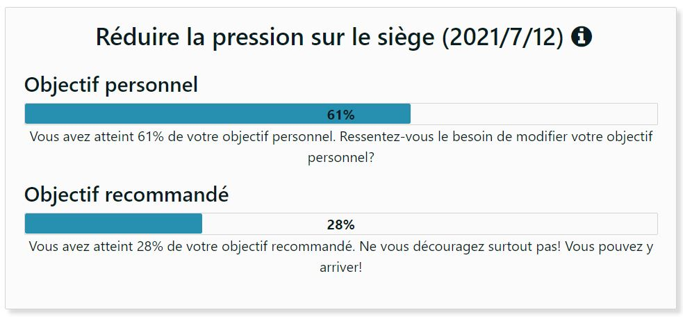

## Time spent in the wheelchair during the day - Bar Graph
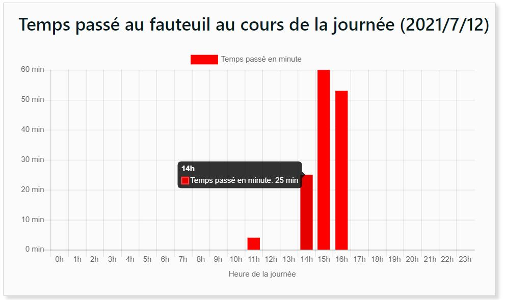

## Distribution of Angles - Pie Chart
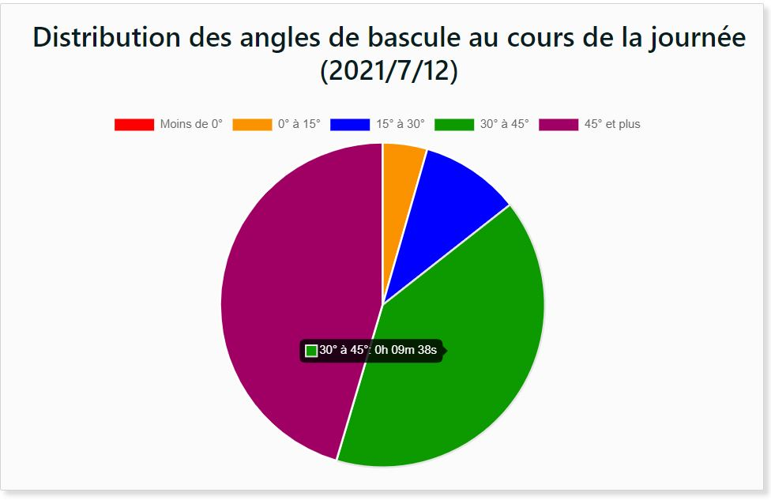

## Number of Tilts Achieved in a Day - Recommended goal - Bar Graph 
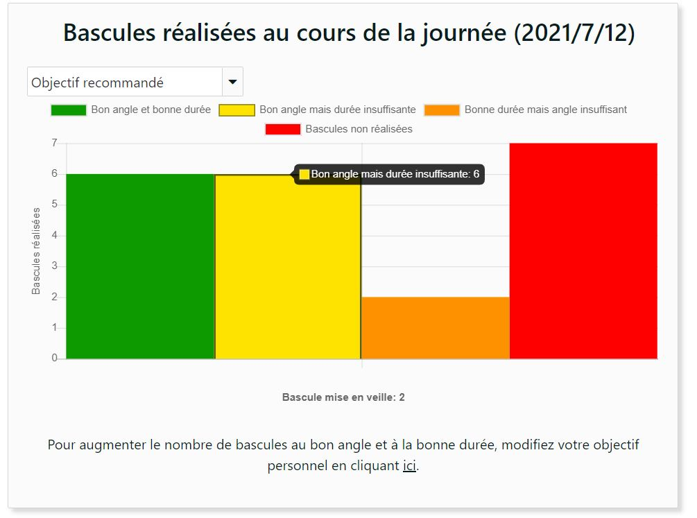

## Number of Tilts Achieved in a Day - Personal goal - Bar Graph 
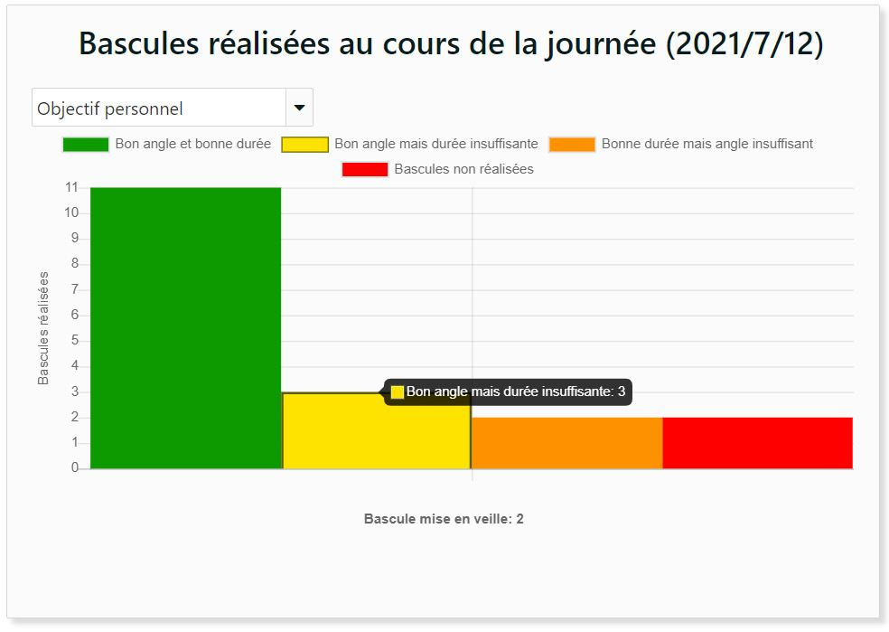

## Reduce Sliding at Rest - Progress Bar
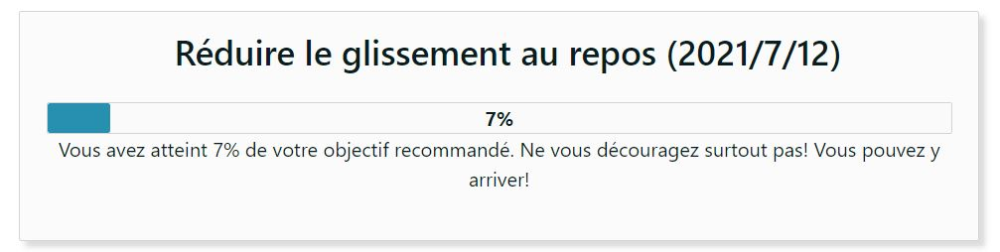

## Reduce Sliding During Travel - Progress Bar
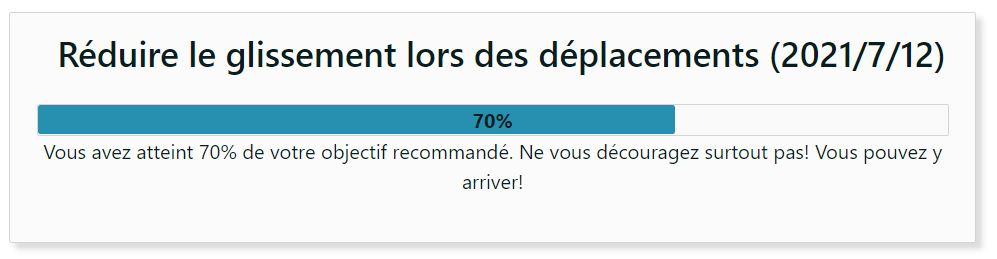


# Example Monthly Graphs
Here are the differents monthly graphs and chart generated from the above sample file

## Relieving Pressure Goal - Bar Graph
For each of the days with data of tilts according to the personal goal, the value of the percentage obtained by the JSON file is displayed according to the day of the month.  

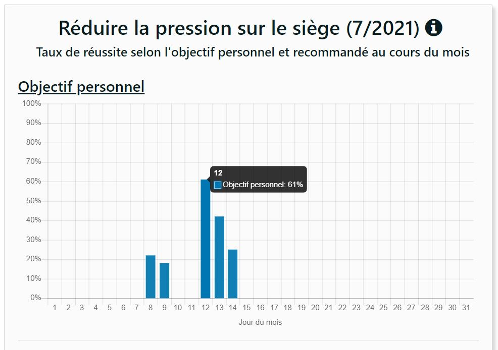
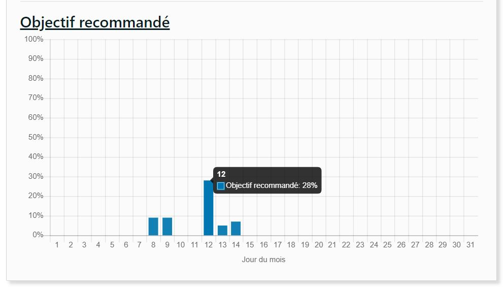

Example:

For day 5, the value with the JSON file: ```"relievePressurePersonalGoalPercent": 0, "relievePressureRecommendedGoalPercent": 0,```  
For day 8, the value with the JSON file: ```"relievePressurePersonalGoalPercent": 22, "relievePressureRecommendedGoalPercent": 9,```   
For day 9, the value with the JSON file: ```"relievePressurePersonalGoalPercent": 18, "relievePressureRecommendedGoalPercent": 9,```  
For day 12, the value with the JSON file: ```"relievePressurePersonalGoalPercent": 61, "relievePressureRecommendedGoalPercent": 28,```  
For day 13, the value with the JSON file: ```"relievePressurePersonalGoalPercent": 42, "relievePressureRecommendedGoalPercent": 5,```  
For day 14, the value with the JSON file: ```"relievePressurePersonalGoalPercent": 25, "relievePressureRecommendedGoalPercent": 7,```  


## Time spent in the wheelchair during the day - Bar Graph
For each day of the month with chair time data, the total value of the time in hours is presented as a function of the day of the month.

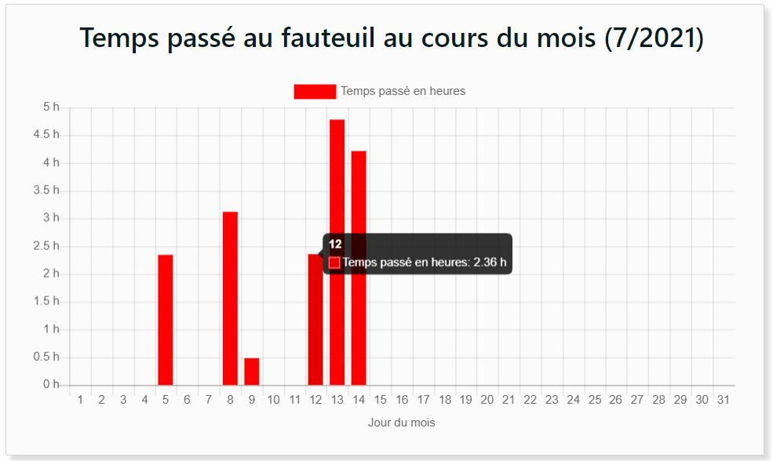

Example for day 12, the values obtained with the JSON file:
```.json
"pressure": {
        "dailySittingTimeMinsPerHour": [
            0,
            0,
            0,
            0,
            0,
            0,
            0,
            0,
            0,
            0,
            0,
            4,
            0,
            0,
            25,
            60,
            53,
            0,
            0,
            0,
            0,
            0,
            0,
            0
        ],
```

The total amount of time seated for this day is therefore:  
Total time = 4 + 25 + 60 + 53 = 142 minutes  
Minute to hour conversion = 142 [min] / 60 [min/h] = 2.36 hours  
The value on the 12th day of July is therefore 2.36 h.  

## Distribution of Angles - Stacked Bar Graph
For each of the days of the month with tilt data, the indexes present in the JSON file: (Less than 0°, 0° to 15°, 15° to 30°, 30° to 45°, More than 45°) are stacked according to the days of the month. The values of each index for a day are the percentages calculated with the values present in the JSON file for that day.

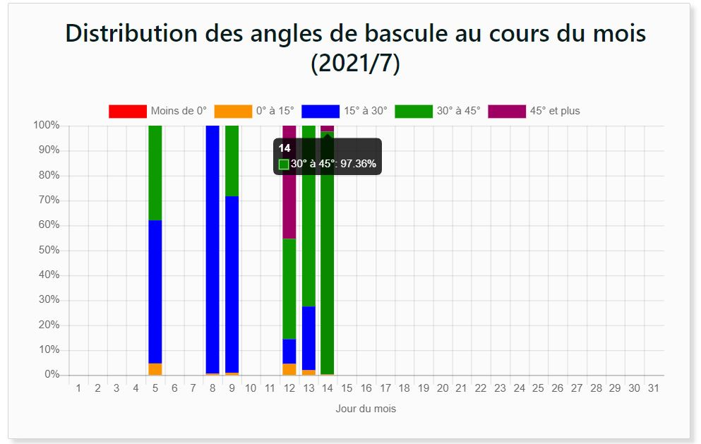

Example for day 14, the values obtained with the JSON file:
``` .json
 "distribution": {
            "index": [
                "Less than 0°",
                "0° to 15°",
                "15° to 30°",
                "30° to 45°",
                "More than 45°"
            ],
            "duration_ms": [
                0,
                3000,
                0,
                1326000,
                33000
            ]
         }
```
The total tilt time is therefore: 3000 + 1326000 + 33000 = 1362000 ms.  
The percentage of the index "30° to 45°": (1,326,000 / 1,362,000) x 100% = 97.36%.  
The percentage of the index "45° and more": (33,000 / 1,362,000) x 100% = 2.42%.  
The percentage of the index "0° to 15°": (3000/1362000) x 100% = 0.22%.  
The other indexes equal 0%.  

## Number of Tilts Achieved in a Day - Recommended goal - Stacked Bar Graph 
For each of the days of the month with tilt data, the indexes present in the JSON file: (Good angle and good duration, Good angle but insufficient duration, Good duration but insufficient angle, Canceled tilt) are stacked according to the days of the month . The values for each index for a day are the recommended goal values present in the JSON file for that day.

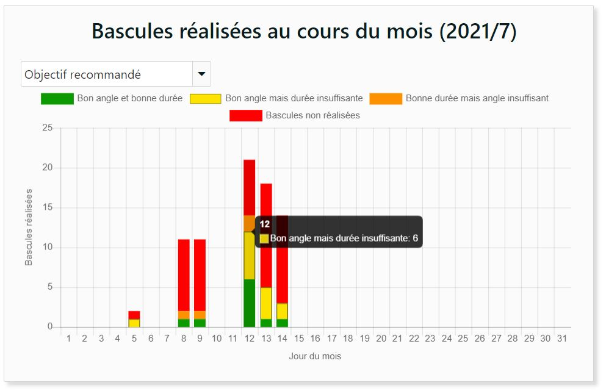

Example for day 12, the values obtained with the JSON file:
``` .json
 "tiltCount": {
            "index": [
                "Good angle and duration",
                "Good angle but insufficient duration",
                "Wrong angle but good duration",
                "Cancelled tilt",
                "Snoozed tilt"
            ],
  "count_clinician": [
                6,
                6,
                2,
                7,
                2
            ]
 ```
The displayed value "Good angle and good duration" is equal to 6.  
The displayed value "Good angle but insufficient duration" is equal to 6.  
The displayed value "Good duration but insufficient angle" is equal to 2.  
The displayed value "Canceled tilt" is equal to 7.  
The "Snoozed tilt" value is not displayed in the month graph.  
The total value of the total tilts is therefore: 6 + 6 + 2 + 7 = 21  

## Number of Tilts Achieved in a Day - Personal goal - Stacked Bar Graph 
For each of the days of the month with tilt data, the indexes present in the JSON file: (Good angle and good duration, Good angle but insufficient duration, Good duration but insufficient angle, Canceled tilt) are stacked according to the days of the month . The values for each index for a day are the personal goal values present in the JSON file for that day.

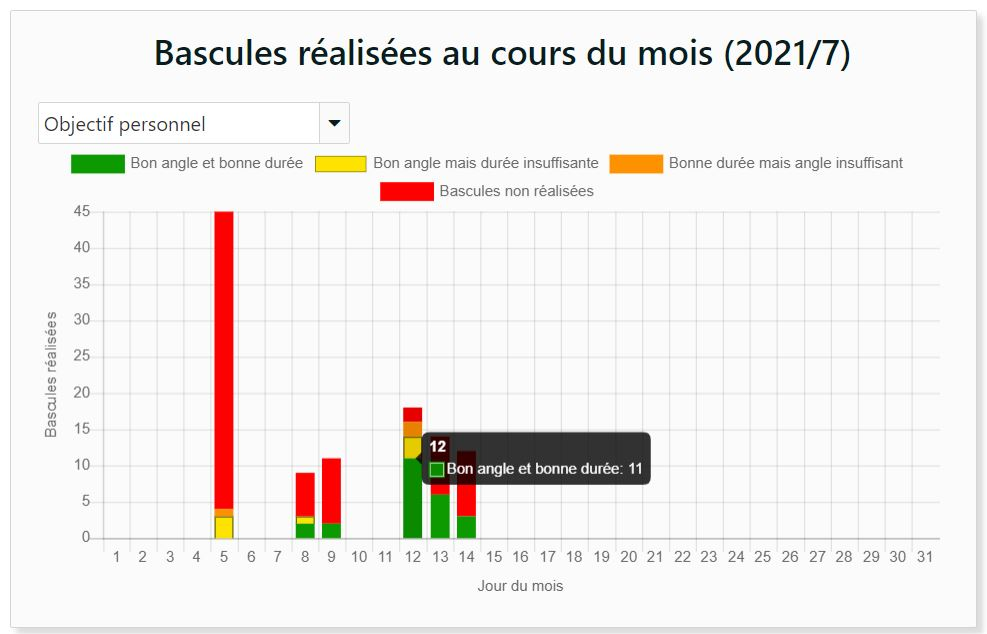
            
Example for day 12, the values obtained with the JSON file:
``` .json
 "tiltCount": {
            "index": [
                "Good angle and duration",
                "Good angle but insufficient duration",
                "Wrong angle but good duration",
                "Cancelled tilt",
                "Snoozed tilt"
            ],
            "count_user": [
                11,
                3,
                2,
                2,
                2
            ],
```
The displayed value "Good angle and good duration" is equal to 11.  
The displayed value "Good angle but insufficient duration" is equal to 3.  
The displayed value "Good duration but insufficient angle" is equal to 2.  
The displayed value "Canceled tilt" is equal to 2.  
The "Snoozed tilt" value is not displayed in the month chart.  
The total value of the total tilts is therefore: 11 + 3 + 2 + 2 = 18  

## Reduce Sliding at Rest - Bar Graphn
For each of the days with data at rest, the percentage value obtained by the JSON file for a day is displayed according to the day of the month.

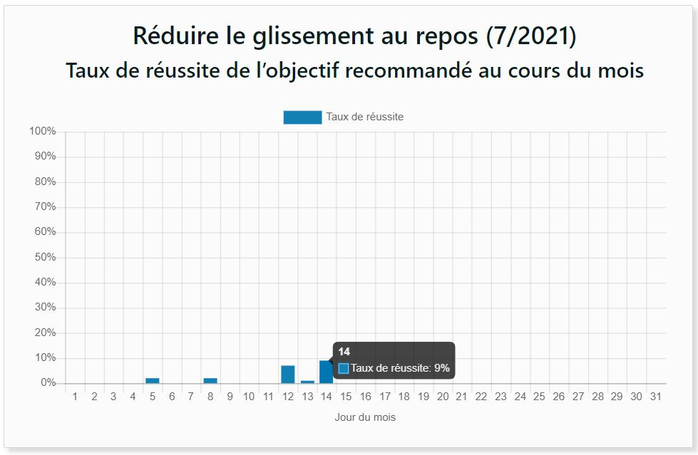

Example:

For day 5, the value with the JSON file: ```"slidingRestGoalPercent": 2,```  
For day 8, the value with the JSON file: ```"slidingRestGoalPercent": 2,```  
For day 9, the value with the JSON file: ```"slidingRestGoalPercent": 0,```  
For day 12, the value with the JSON file: ```"slidingRestGoalPercent": 7,```  
For day 13, the value with the JSON file: ```"slidingRestGoalPercent": 1,```  
For day 14, the value with the JSON file: ```"slidingRestGoalPercent": 9,```  

## Reduce Sliding During Travel - Bar Graph
For each of the days with data while moving, the percentage value obtained by the JSON file for a day is displayed according to the day of the month.

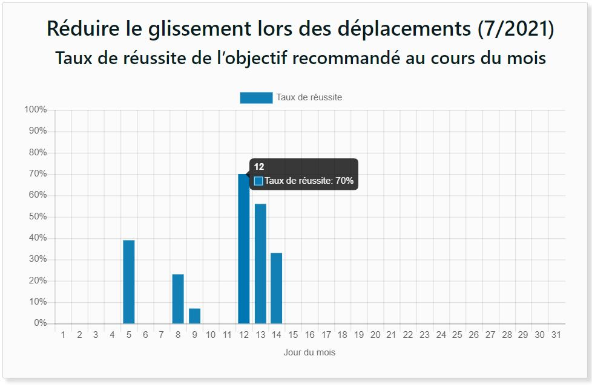

Example:

For day 5, the value with the JSON file: ```"slidingTravelGoalPercent": 39,```  
For day 8, the value with the JSON file: ```"slidingTravelGoalPercent": 23,```  
For day 9, the value with the JSON file: ```"slidingTravelGoalPercent": 7,```  
For day 12, the value with the JSON file: ```"slidingTravelGoalPercent": 70,```  
For day 13, the value with the JSON file: ```"slidingTravelGoalPercent": 56,```  
For day 14, the value with the JSON file: ```"slidingTravelGoalPercent": 33,```
